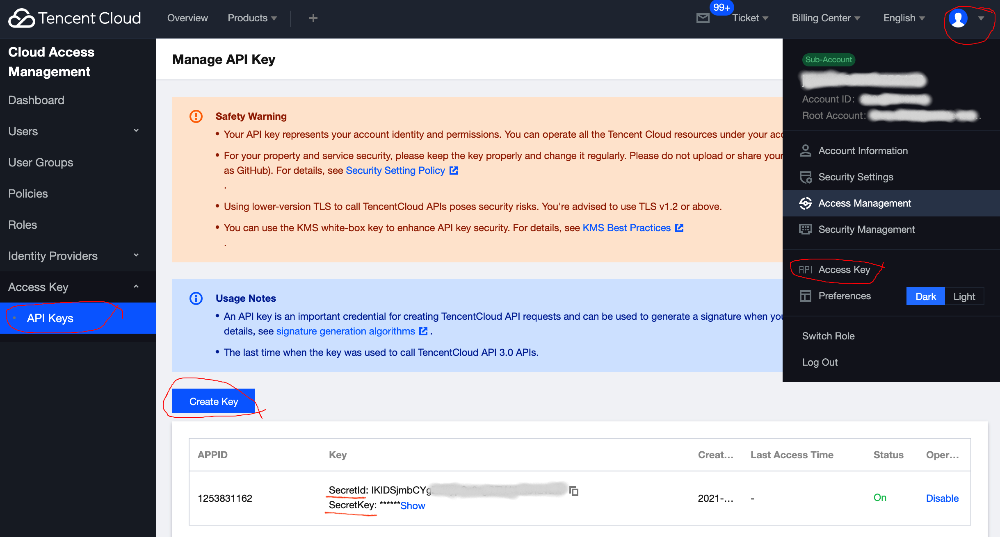

# Build Infrastructure

With Terraform installed, we are ready to create some infrastructure.

We will build infrastructure on [Tencent Cloud Platform](https://intl.cloud.tencent.com/campaign/freetier) for this tutorial, but Terraform can manage a wide variety of resources using [providers](https://www.terraform.io/language/providers). You can find more examples in the [use cases section](https://www.terraform.io/intro/use-cases).

As you follow the tutorials in this collection, you will use Terraform to provision, update, and destroy a simple set of infrastructure using the sample configuration provided. The sample configuration provisions a network and a Linux virtual machine. You will also learn about remote backends, input and output variables, and how to configure resource dependencies. These are the building blocks for more complex configurations.

## Prerequisites

- A Google Cloud Platform account. If you do not have a GCP account, create one now. This tutorial can be completed using only the services included in the GCP free tier.

- Terraform 0.14.06+ installed locally. 1.0.0+ is preferred.

## Set up Tencent Cloud Access

After creating your Tencent Cloud account, you can create the access key for your Terraform code to provision resources in your account.

When creating the key, use the following settings:



- Click the user profile icon on the upper-right corner.
- Click "Access Key" from the dropdown menu.
- When the page refreshed to "Cloud Access Management" page. You should see the "Access Key" menu on the left.
- Click "API Keys" sub-menu, you will see the "Manage API Key" page.
- If you don't have any key created yet, you can click "Create Key" to create a new key. Write down the "SecretId" and "SecretKey" to a safe place. We will use them for our Terraform code.

## Write Configuration

The set of files used to describe infrastructure in Terraform is known as a Terraform configuration. We will now write our first configuration to create a network.

Each Terraform configuration must be in its own working directory. Create a directory for your configuration.

```
mkdir learn-terraform-tc
cd learn-terraform-tc
mkdir simple
```

Change into this directory

```
cd simple
```

### Create file structure

Terraform loads all files ending in .tf or .tf.json in the working directory. It then parses the configuration information in all files, sorts their dependencies, and then executes the configuration concurrently for resources without depencies. So, please **NOTE** two key points here:
- The terraform file names are only used to help us organize our configuration. It doesn't make difference which file the configuration content belongs to.
- Resouce configuration are executed concurrently if there is no dependency between those resources.

So, the following file names are just my preferrence for organizing Terraform code. You can put them into other file names or even put them into one single file.

Let's create several files.
- version.tf
- provider.tf
- main.tf
- terraform.tfvars
- variables.tf
- outputs.tf

Note: _terraform.tfvars_ is one way to pass input variables to Terraform configuration. We will discuss this more in the next section.

### version.tf

We will put the following content into _version.tf_.
```
terraform {
  required_version = ">= 0.14.06"

  required_providers {
    tencentcloud = {
      source  = "tencentcloudstack/tencentcloud"
      version = ">=1.56.15"
    }
  }
}
```

In this snippet, we instruct Terraform to use version 0.14.06+. Also, it instructs Terraform to download Tencent Cloud Provider. We will use Tencent Cloud Provider version 1.56.15+.

### provider.tf

We will provide our access Key to Terraform. Also, we are specifying which region Terraform will provision the resources for us. In our current provider, we don't support providing region for each resource yet.

```
provider "tencentcloud" {
  secret_id  = var.secret_id
  secret_key = var.secret_key
  region     = var.region
}
```

Please note that the _secret\_id_ and _secret\_key are passed in as variables. We will see their definition in _variables.tf_ soon.

### main.tf

Let's create a VPC first.

```
resource "tencentcloud_vpc" "jliao-vpc" {
  name         = "vpc-jliao-tf"
  cidr_block   = "10.2.0.0/16"
  dns_servers  = ["183.60.83.19", "183.60.82.98", "8.8.8.8"]
  is_multicast = false

  tags = {
    "bu" = "nasa"
    "created_by" = "jliao"    	
  }
}
```  

The resource ["tencentcloud_vpc"](https://registry.terraform.io/providers/tencentcloudstack/tencentcloud/latest/docs/resources/vpc) is the VPC Terraform API provided by Tencent Provider. You can change this VPC resource name "jliao-vpc" to your own name. But, please remember that we will use this name to refer to any attributes in this VPC resource. If you want some more fun, please refer to ["tencentcloud_vpc"](https://registry.terraform.io/providers/tencentcloudstack/tencentcloud/latest/docs/resources/vpc) to add any additional VPC attribute(s) into this snippet.

### variables.tf

Remember that we have three variables in _provider.tf_ file. We will discuss the input variables in details in next session. For now, we just define the variables, so we can input values for these variables.

```
variable "secret_id" {
  type = string
}

variable "secret_key" {
  type = string
}

variable "region" {
  type = string
}
```

### terraform.tfvars

For simplicity at this stage, we will just use terraform.tfvars to pass in the values for input variables. Again, the `tfvars` suffix is important, but the file name `terraform` is not important.

```
region = "na-siliconvalley"
secret_id  = "IKIDSjmbCYgZEftyxxxxxxxxxxxxx"
secret_key = "4tUr0uYw4ze4FFFFFFFFFFFFFFFFF"
```

Please change the region to your target region, you can find Tencent Cloud region values [here](https://intl.cloud.tencent.com/document/product/213/6091). Also, please change the access key information to your own.

You can find the source code discussed above under [src/simple](../src/simple) directory.

## Provision your first resource via terraform

### Initialize Terraform environment

Run the following command in your _"learn-terraform-tc/simple"_ directory
```
terraform init
```

### Prettify your Terraform
Use the following command to unify your code in a standard format.
```
terraform fmt
```

### Plan your resource
Check and verify the resource you plan to provision.
```
terraform Plan
```

### Provision your resource
If everything is planned as you expected, you can commit the resource into Tencent Cloud. When Terraform asks you to confirm, please just type "yes"
```
terraform apply
```

Now, you can check the created VPC in your Tencent Cloud account by logging into the Console.


[Main](../README.md) / [Prev](./02-installation.md) / [Next](./04-build-infra.md)
