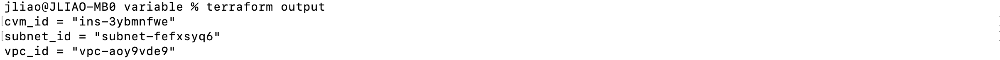

# Query Data with Output Variables

In the previous tutorial, we used input variables to parameterize our Terraform configuration. In this tutorial, we will use output values to organize data to be easily queried and displayed to the Terraform user.

When building complex infrastructure, Terraform stores hundreds or thousands of attribute values for all our resources. As users of Terraform, we may only be interested in a few values of importance. Outputs designate which data to display. This data is outputted when apply is called, and can be queried using the terraform output command.

Also, the output variables can be used to query values for modules. We will utilize this feature in next session.

## Define outputs

Let's define the output for the VPC ID, Subnet ID and CVM ID by referring to the exported attributes of those resources.

Open the `outputs.tf` file, and add the following content.

```
output "vpc_id" {
  value = tencentcloud_vpc.jliao-vpc.id
}

output "subnet_id" {
  value = tencentcloud_subnet.subnet1.id
}

output "subnet_id" {
  value = tencentcloud_instance.tf_test_cvm.id
}
```

This defines the "id" output variables. The name of the variable must conform to Terraform variable naming conventions if it is to be used as an input to other modules. The value field specifies the value. We can always refer to Tencent Cloud document for the exported attributes. You can add more output variables into our example code by checking the API for [VPC](https://registry.terraform.io/providers/tencentcloudstack/tencentcloud/latest/docs/resources/vpc#attributes-reference), [Subnet](https://registry.terraform.io/providers/tencentcloudstack/tencentcloud/latest/docs/resources/subnet#attributes-reference), and [CVM](https://registry.terraform.io/providers/tencentcloudstack/tencentcloud/latest/docs/resources/instance#attributes-reference).

## Inspect Outputs

You must apply this configuration before you can use these output values. Apply your configuration now. Respond to the confirmation prompt with `yes` when you run `terraform apply`.


The outputs will display when the command runs successfully. We can also query the outputs with the `terraform output` command.



You can use Terraform outputs to connect your Terraform projects with other parts of your infrastructure, or with other Terraform projects. To learn more, follow our in-depth tutorial, [Output Data from Terraform](https://learn.hashicorp.com/tutorials/terraform/outputs?in=terraform/configuration-language).

[Main](../README.md) / [Prev](./06-define-inputs.md) / [Next](./08-build-with-modules.md)
